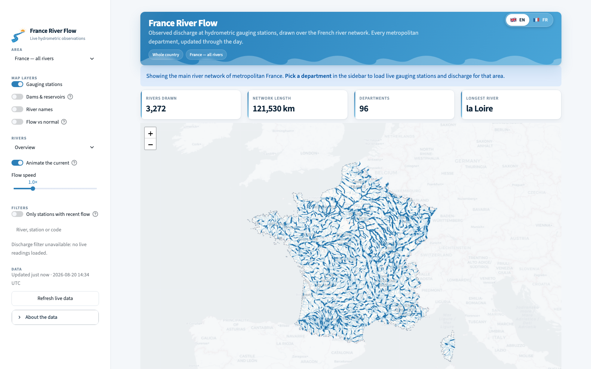
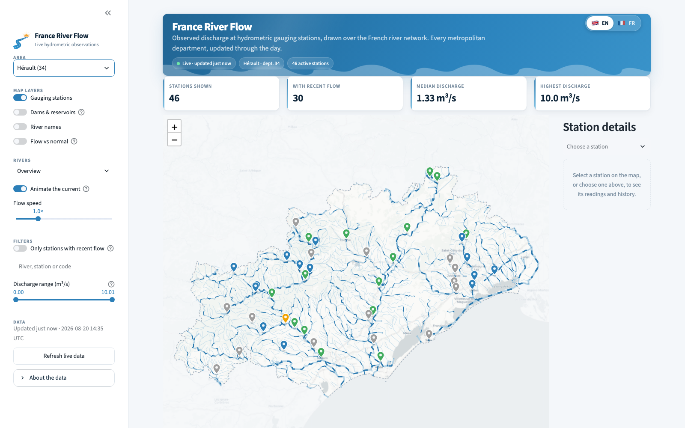
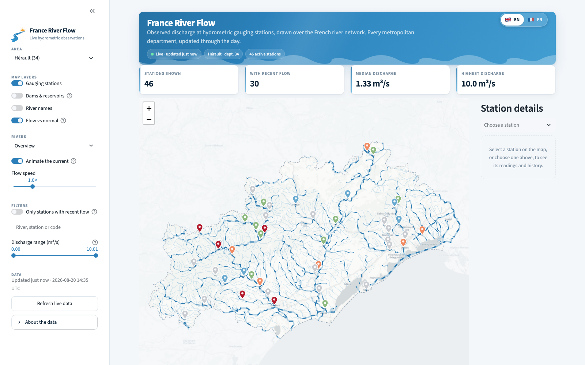

# France River Flow

[](https://github.com/Deepak420-GrandMaster/France-River-Flow-Map/actions/workflows/ci.yml)
[](https://www.python.org/)
[](https://streamlit.io/)
[](LICENSE)

An interactive, free map of **live river discharge across France**. It combines
real-time hydrometric readings from [Hub'Eau](https://hubeau.eaufrance.fr/)
with the French river network from **BD TOPAGE**, and renders both on a light
Streamlit + Folium dashboard where the main rivers visibly *flow downstream*.

The app opens on **the whole of metropolitan France** — 3,272 rivers, 121,530 km
of network — and drills down into any of the **96 departments** for live
gauging stations. Interface in **English or French**.

No API keys. No accounts. No database. No paid services.

---

## Screenshots

**The whole country on load** — 3,272 rivers, animated downstream.



**Any department, with live gauging stations** — pins coloured by discharge.



**Flow vs normal** — today's discharge against the median for this month across
10–25 years of record.



Refresh these after a UI change:

```bash
python scripts/capture_screenshots.py
```

## Features

**Map**
- **National landing view** — the main river network of metropolitan France in
  one 2.8 MB layer; pick a department for live readings.
- **Animated river flow** — dashes travel downstream along the main rivers, with
  a speed control spanning roughly 24 to 240 px/s. Light basemap throughout;
  no dark theme.
- **Google-Maps-style pins** for gauging stations, with hover lift and a drop
  animation on the selected one.
- **Everything outside the selected department is dimmed**, so the chosen area
  is the subject of the map rather than one patch of a wider region.
- Real BD TOPAGE geometry, in three levels: Overview / Detailed / Hide rivers.
- **Gauging stations** coloured by latest discharge, with hover tooltips and popups.
- **Dams & reservoirs** from BD TOPAGE PlanEau (1,073 dams, 4,700 reservoirs nationally).
- **River name labels** for the largest watercourses in view.
- **Flow vs normal** — recolours stations by today's discharge against the median
  for the same calendar month across 10–25 years of record.
- Collapsible legend that adapts to the active colouring.

**Data**
- Summary metrics: stations shown, stations with recent flow, median and highest discharge.
- Freshness labels — *Recent*, *Delayed*, *Unavailable* — so a stale reading never looks live.
- Station details: reference data, freshness, seasonal normal, and a Plotly
  discharge history (24 hours or 7 days) with the seasonal normal marked.
- Filtered, sortable station table with CSV download, plus a top-10 discharge chart.
- Search across station name, river name and station code.
- Filter by city (commune) — multi-select, resets when the department changes.

**Interface**
- **English / French** switch in the top right, covering every string in the UI
  including table headers, freshness labels and error messages.
- Collapsible legend that adapts to the active colouring.

**Resilience**
- Degrades gracefully when Hub'Eau is slow or down: the river network, dams and
  all controls keep working, and the header says so.
- **Last-known-good snapshot** — a successful fetch is written to disk, and if
  a later fetch fails the app shows those readings *clearly labelled with when
  they were taken*. Nothing is estimated: each value keeps its own measurement
  timestamp and freshness label.

---

## Data sources and attribution

| Source | Used for | Licence / cost |
|---|---|---|
| [Hub'Eau Hydrométrie API v2](https://hubeau.eaufrance.fr/page/api-hydrometrie) | Stations, real-time discharge, monthly normals | Open, free, no key |
| [BD TOPAGE 2024](https://www.sandre.eaufrance.fr/) (IGN / OFB) | River network, dams, reservoirs | Open data |
| [france-geojson](https://github.com/gregoiredavid/france-geojson) | Department boundaries | Open data |
| [Esri Light Gray Canvas](https://www.arcgis.com/home/item.html?id=979c6cc89af9449cbeb5342a439c6a76) | Basemap tiles | Free, no key |

In-app attribution: **Sources: Hub'Eau Hydrométrie, BD TOPAGE, Esri Light Gray Canvas**

### Basemap

CARTO now requires an API key for its raster basemaps. The keyless endpoints
still return tiles, but each one arrives stamped **API KEY REQUIRED**, so the
watermark tiled itself across the map. The basemap is therefore Esri's Light
Gray Canvas, which needs no key or sign-up and is close enough to Positron
that the app's theme still reads as one interface. Its raster tiles stop at
zoom 16; past that Leaflet upscales the last native level rather than showing
blanks, and the app never auto-zooms beyond 15.

To go back to Positron, get a key from
[carto.com/basemaps](https://carto.com/basemaps/) and set `CARTO_API_KEY` --
as an environment variable locally, or in **Settings -> Secrets** on Streamlit
Community Cloud:

```toml
# .streamlit/secrets.toml  (gitignored)
CARTO_API_KEY = "your-key"
```

The tiles, their attribution and the in-app source line all follow from that
one variable; nothing else needs changing.

### Units — important

Hub'Eau publishes discharge (`grandeur_hydro=Q`) in **litres per second**.
The app converts every value once, centrally:

```python
flow_m3s = flow_lps / 1000
```

`m³/s` is the headline unit throughout. The raw L/s value is shown as a
secondary detail so the published figure stays traceable.

### API behaviour worth knowing

Verified against the live API and encoded in the client and its tests:

- **Observations filter on `code_entite`, not `code_station`.** Passing
  `code_station` to `/observations_tr` does *not* filter and silently returns
  unrelated rows.
- **HTTP 206 is a success.** Hub'Eau uses it for partial/paginated content;
  the client accepts both 200 and 206.
- **`code_entite` accepts a comma-separated list**, so a whole department's
  stations are fetched in **one request** rather than one per station.
- **Hub'Eau is genuinely intermittent.** Observed in one afternoon: normal
  sub-second responses, then a period of ~9.7 s responses, then connection
  resets at exactly 10 s, then `HTTP 503`. TCP and TLS complete instantly
  throughout, so the delay is in the application tier, not the network.
  Consequences baked into the client: generous timeouts (**15 s connect,
  60 s read** — a tight connect timeout turns slow-but-successful calls into
  hard failures), bounded retries with backoff, a 10-minute cache, and the
  on-disk snapshot fallback.
- **Monthly normals use `grandeur_hydro_elab=QmM`** on `/obs_elab`. `QM` and
  `QmnM` are rejected; daily means are `QmnJ`.
- Observation rows *do* include `code_station`, but the client keeps the
  requested code as a fallback so a missing field cannot mislabel a station.
- `NumeroOrdr` in BD TOPAGE is **entirely null** — unusable for ranking rivers.
  `ReseauPrin` (main-network flag) is used instead.

---

## Data limitations

- Readings are **provisional real-time observations**, not validated records.
- Live readings may be **delayed or missing**; the app labels this rather than guessing.
- Station coverage is **incomplete** — most watercourses have no gauge.
- **A drawn river line does not imply a live measurement.** The river network is context.
- **No dam or reservoir here is measured in real time.** They are locations only.
- "Normal" is a **median of monthly means**, not a full statistical climatology.
  Stations with under 5 years of record are left unclassified.
- This is **not a flood-warning system** and not a water-quality indicator.

---

## Architecture

```text
france-river-flow-map/
├── app.py                      # Streamlit entry point: layout, controls, wiring
├── src/
│   ├── config.py               # Paths, region registry, CRS, colours, thresholds
│   ├── data_loading.py         # Streamlit caching layer (the only st.* in src/)
│   ├── rivers.py               # River layer loading + styling
│   ├── services/
│   │   └── hubeau.py           # Hub'Eau API client (no Streamlit dependency)
│   └── utils/
│       ├── theme.py            # Design system: tokens, components, motion
│       ├── formatters.py       # Units, timestamps, freshness classification
│       ├── map_helpers.py      # Folium map, flow animation, popups, labels
│       └── tables.py           # Filtering + display table
├── scripts/
│   ├── prepare_boundaries.py   # Department registry + outlines (all 96)
│   ├── prepare_rivers.py       # BD TOPAGE -> per-department river layers
│   ├── prepare_dams.py         # PlanEau -> dams & reservoirs per department
│   └── check_hubeau_api.py     # Manual API diagnostic
├── tests/                      # pytest, no network access
├── data/
│   ├── raw/                    # Source downloads — gitignored, local only
│   └── processed/              # Small committed layers used at runtime
│       ├── regions.json        #   registry of all 96 departments
│       ├── boundaries/         #   dep{code}.geojson
│       ├── rivers/             #   dep{code}_overview.geojson
│       └── dams/               #   dep{code}.geojson
└── .streamlit/config.toml      # Light theme
```

Design rules:

- **`src/services/hubeau.py` has no Streamlit import**, so it is testable in
  isolation. All caching lives in `src/data_loading.py`.
- **No absolute paths.** Everything resolves from `PROJECT_ROOT` in
  `src/config.py`, derived from the module location, so the app works from any
  working directory.
- **The app never reads raw national data at runtime**, only small processed layers.
- **All CSS lives in `src/utils/theme.py`**, keyed on Streamlit's stable
  `data-testid` selectors rather than generated class names.

---

## Local setup (macOS)

```bash
python3 -m venv .venv
```

```bash
source .venv/bin/activate
```

```bash
python -m pip install -r requirements.txt
```

### Run the app

```bash
python -m streamlit run app.py
```

Opens at <http://localhost:8501>. It works immediately — the processed layers
for all 96 departments are committed.

### Run the tests

```bash
python -m pytest
```

No network access required. Dev extras (pytest, ruff):

```bash
python -m pip install -r requirements-dev.txt
```

### Check the live API

```bash
python scripts/check_hubeau_api.py
```

The diagnostic that replaces the original `test_api.py` and `test_flow.py`:
it probes the station reference, the bulk discharge fetch and the 24-hour
history. Use it to tell "the app is broken" apart from "Hub'Eau is down".

---

## Preprocessing

**You only need this to regenerate or extend the map layers.** Everything the
app reads is already committed.

BD TOPAGE ships 3,013,824 river segments for metropolitan France (a 690 MB
ZIP). That file is **not** in the repository. To rebuild from source:

1. Download `TronconHydrographique_FXX-shp.zip` and `PlanEau_FXX-shp.zip` from
   BD TOPAGE 2024.
2. Place them in `data/raw/BD_Topage_FXX_2024-shp/`.
3. Run, in order:

```bash
python scripts/prepare_boundaries.py --force
```

```bash
python scripts/prepare_rivers.py --all --force
```

```bash
python scripts/prepare_dams.py --all --force
```

A single department, including its richer detail layer:

```bash
python scripts/prepare_rivers.py --department 33 --level detail --force
```

### How the reduction works

A naive bounding-box extract produced **134,562 segments / 132 MB** for one
department, which made Folium unusable. The pipeline cuts that in four stages:

1. **Spatial filter** — one national read (~20 s, ~2 GB RAM) joined against all
   96 department polygons. 96 separate bounding-box reads would each rescan the
   690 MB shapefile: over 20 minutes instead of under one.
2. **Attribute filter** — the overview keeps BD TOPAGE's `ReseauPrin`
   main-network flag: 3,013,824 → 1,273,555 segments.
3. **Dissolve by watercourse + line merge** — the single biggest win, because
   Folium serialises every *feature* into the page. For Hérault, 15,970
   segments become 1,704 watercourses.
4. **Length filter and Douglas-Peucker simplification**, both in **EPSG:2154**
   so thresholds are real metres. Output is reprojected to EPSG:4326 last, at
   5-decimal precision (~1 m).

Tuning constants sit at the top of `scripts/prepare_rivers.py`:

| Level | Filter | Min length | Tolerance | Built for |
|---|---|---|---|---|
| `overview` (default) | main network only | 2,000 m | 60 m | all 96 departments |
| `detail` | all watercourses | 500 m | 20 m | on demand |

Measured output:

| Layer | Files | Total size | Example |
|---|---|---|---|
| `rivers/france_overview.geojson` | 1 | **2.8 MB** | 3,272 rivers ≥ 15 km |
| `rivers/dep*_overview.geojson` | 96 | **30 MB** | Hérault: 895 features, 0.44 MB |
| `boundaries/*.geojson` | 97 | **1.2 MB** | dept. outlines + national |
| `dams/*.geojson` | 96 | **1.4 MB** | Hérault: 13 structures |

Total committed payload: **~35 MB**. Full national build: **~90 seconds**.

Build the national landing layer with:

```bash
python scripts/prepare_rivers.py --national --force
```

Detail layers for all 96 departments would add roughly 200 MB, so they are
gitignored by default. The app falls back to the overview layer and says so.

### Rendering performance

Three measured problems, and what was done about them:

1. **1,009 SVG paths per map.** Folium renders everything through one Leaflet
   renderer. Switching the map default to **canvas** and giving only the
   animated subset an explicit **SVG** renderer took the DOM from
   **1,009 paths to 113** — the rest are drawn on 3 canvases. Panning and
   zooming went from visibly sticky to smooth. `src/utils/flow_layer.py`
   exists for exactly this: `folium.GeoJson` cannot choose a renderer.
2. **`st_folium` only re-renders when the map's *script* changes.** Its
   component key is `generate_js_hash(leaflet, ...)`, computed from the
   Leaflet script alone. Anything living purely in the `<style>` block can
   change freely without the component ever updating — which is precisely why
   the flow-speed slider appeared inert: the server was emitting the new
   duration, but the browser never received it. The duration is now published
   from the script as a CSS custom property (`src/utils/flow_layer.py`,
   `FlowSpeed`), and a test asserts that three different speeds produce three
   different component keys.
3. **Folium mints a fresh UUID for every element on every build.**
   `stabilise_ids` derives ids from the inputs instead, so an unchanged map is
   byte-identical and reproducible. (Two subtleties: `Popup` keeps its `Html`
   child in a plain attribute rather than in `_children`, and folium reuses the
   `_children` **dict keys** as JavaScript variable names — both need
   rewriting.)
4. **Animated paths are capped at 550.** The animated layer is the only SVG
   layer, and every path in it is a DOM node repainted each frame. The national
   layer marks nearly every river as "major", which would have put 3,272 paths
   on screen; the longest 550 are animated and the rest fall back to canvas, so
   no river is lost. Hérault uses 110 of 895.

`prefers-reduced-motion` disables all decorative motion.

---

## Adding or refreshing a department

Every metropolitan department is already registered and selectable. To rebuild
one department's layers:

```bash
python scripts/prepare_rivers.py --department 69 --force
```

```bash
python scripts/prepare_dams.py --department 69 --force
```

Verify Hub'Eau station coverage for it:

```bash
python scripts/check_hubeau_api.py --department 69
```

Overseas departments (971–976) are **not** covered: BD TOPAGE `FXX` is
metropolitan France only. Hub'Eau does serve them, so adding them would need a
different geometry source.

---

## Performance notes

| Decision | Why |
|---|---|
| One bulk `code_entite` request instead of one per station | 46 sequential calls took tens of seconds and risked throttling. Bulk: ~1–2 s. |
| 3-hour observation lookback | Measured: 2 h → 29 stations in 1 page (~1.0 s); 3 h → 29 in 1 page (~1.9 s); 6 h → 30 but 4 pages (~3.7 s). |
| Seasonal normals only fetched when the toggle is on | It is an extra multi-year query; nobody should pay for it by default. |
| Dissolve rivers by watercourse | Feature count, not byte size, is what stalls Folium. |
| Animate only major rivers | ~110 paths instead of ~900, at the same visual effect. |
| SVG renderer (not canvas) | The flow animation is CSS on `stroke-dashoffset`, which needs SVG paths. |
| Zoom computed in Python, not `fit_bounds` | Inside the `st_folium` iframe, `fit_bounds` runs before layout and snaps to max zoom, blanking the map. |
| Sidebar drawn before the API call | The shell is interactive while data loads. |
| Generous timeouts (15 s / 60 s) | Hub'Eau answers in ~10 s under load; a tight connect timeout turned those successes into failures. |
| Canvas for static rivers, SVG only for animated | 1,009 SVG paths → 113. |
| Deterministic folium element ids | Reproducible, testable map output. |
| Animation duration published from the script | `st_folium` hashes the script only; style-only changes never reach the browser. |
| Explicit `key=` on every sidebar widget | Without one, Streamlit discards widget state on the rerun `st_folium` triggers, so controls snap back to their defaults. |
| Animated paths capped at 550 | The national layer would otherwise animate 3,272 SVG paths. |
| National view skips the station fetch | Live discharge is a per-department query; all of France would be dozens of API calls per page load. |
| `st.cache_data` TTLs: 10 min live, 1 h reference, 24 h normals | Matches how often each actually changes. |
| Refresh button clears **only** live caches | The GeoJSON layers never change at runtime. |
| History fetched only after a station is selected | No wasted API call on first load. |

---

## Deployment — GitHub

```bash
git init
```

```bash
git add .
```

```bash
git commit -m "France River Flow: all-France dashboard with animated river flow"
```

```bash
git branch -M main
```

```bash
git remote add origin YOUR_GITHUB_REPOSITORY_URL
```

```bash
git push -u origin main
```

`.gitignore` keeps `.venv/`, `__pycache__/`, `.DS_Store`,
`.streamlit/secrets.toml`, `data/raw/`, the legacy `data:raw/`, all
shapefile/ZIP artefacts and the on-demand detail layers out of the repository,
while committing the ~32 MB of processed layers the app needs at runtime.

Verify before pushing:

```bash
git status --short && du -ch $(git diff --cached --name-only) | tail -1
```

---

## Deployment — Streamlit Community Cloud

1. Push the repository to GitHub (public or private — both work on the free tier).
2. Go to <https://share.streamlit.io> and sign in with GitHub.
3. Click **Create app** → **Deploy a public app from GitHub**.
4. Fill in:
   - **Repository:** `your-username/france-river-flow-map`
   - **Branch:** `main`
   - **Main file path:** `app.py`
5. *(Optional)* **Advanced settings** → **Python version: 3.12** or 3.13.
   The code targets 3.9+ syntax, so any supported version works.
6. Click **Deploy**. The first build installs `requirements.txt`; the
   geospatial wheels take a few minutes. Later restarts are fast.

No secrets, environment variables or `packages.txt` are required: `pyogrio` and
`shapely` ship manylinux wheels with GEOS bundled, and the app only reads
committed GeoJSON plus a public API.

**Resource fit on the free tier:** one department's layers are a few MB, and
`load_rivers` caps its cache at 6 entries so browsing many departments cannot
grow memory without bound. Comfortably inside the 1 GB limit.

**If the build fails on the geospatial stack:** `geopandas`, `pyogrio` and
`shapely` are only used by the `scripts/prepare_*.py` preprocessing, never at
runtime. Drop those three lines from `requirements.txt` for a leaner, faster
deploy and keep them in `requirements-dev.txt` for local work.

---

## Future enhancements

- Water level (`grandeur_hydro=H`) alongside discharge.
- Percentile bands (Q10/Q90) rather than a single median normal.
- Detail river layers shipped as vector tiles or PMTiles instead of GeoJSON.
- Sparklines in the station table.
- A cached "last known good" snapshot so values survive a Hub'Eau outage.
- Overseas departments, using a non-BD-TOPAGE geometry source.

---

## Security

The app takes no user accounts, stores no personal data, and holds no secrets.
The parts that could still go wrong are covered by `tests/test_security.py`:

| Risk | Mitigation |
|---|---|
| **Path traversal** — department codes and level-of-detail strings are interpolated into filenames | `validate_department_code()` enforces `\d{2}\|2A\|2B\|FR`; `processed_path()` resolves and refuses anything outside `data/processed` |
| **HTML injection** — station and river names come from a third-party API and are rendered through `unsafe_allow_html` | Every dynamic value is `html.escape()`d before it reaches markup |
| **Script breakout** — the river layer is serialised into an inline `<script>`, and JSON does not escape `/`, so a name containing `</script>` would end the script element | `embed_json()` encodes `<`, `>`, `&`, U+2028 and U+2029 as unicode escapes; the value still parses back identically |
| **Information disclosure** — a traceback in the browser leaks paths and internals | `showErrorDetails = "none"` in `.streamlit/config.toml`; service errors raise `HubeauError` with a user-safe message and log the detail server-side |
| **Unexpected outbound requests** | A test asserts every runtime endpoint is on `https://hubeau.eaufrance.fr/` |
| **Secrets in the tree** | A test greps the source for key/token/password patterns |

`ruff` runs with the `S` (bandit) rules enabled in CI.

Found something? Open a security advisory on the repository rather than a
public issue.

---

## Licence and disclaimer

Code is MIT licensed — see [LICENSE](LICENSE).

The **data is not**: Hub'Eau (eaufrance.fr) and BD TOPAGE (IGN / OFB) publish
under their own open-data terms, so check those before redistributing derived
datasets.

This project is for information and portfolio purposes. It is **not** an
official hydrological service and must not be used for flood safety decisions.

Created by **Deepak Prajapati**.
